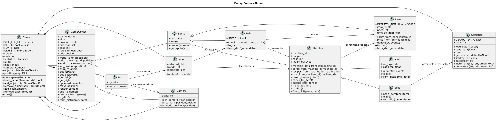

# Funky Factory Game

smth for my final semester

## Control

R - Rotate machine @ your cursor (if insert is selected, it will rotate the item you are spawning) 
M - Switch mode (Insert, Move, Delete) 
1 - 9 - Quick select facility inside insert mode 
D - Debug 

## UML

